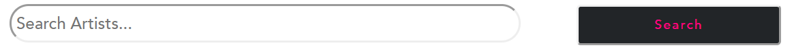

# How to use The Drop x Nology's Utility Components: 

## Buttons (Small and Large)
 1) import SmallButton from the correct pathway from the correct Utility component pathway 

 2) Copy and paste this code for either SmallButton or LargeButton: 

## SmallButton:
 ```
<SmallButton text={""} />
```
### Here's what this Component looks like: 


## LargeButton:
 ```
<LargeButton text={""} />
```
### Here's what this Component looks like: 


### N.B: You will need to input the label/text in the {""} section or this will be a blank button

## Searchbar

1) import Searchbar from the correct pathway from the correct utility component pathway

2) Copy and paste this code for a searchbar:
```
<SearchBar placeholder = {""} />
```
### N.B: You will need to input the label/text in the {""} section or this will be a blank placeholder.

### Here's what this Component looks like: 



## Header

1) import Header from the correct utility component pathway

2) Copy and paste this code for a Header:
```
<Header title = {""} />
```
### N.B: You will need to input the label/text in the {""} section or this will be a blank Header.

### Here's what this Component looks like: 


